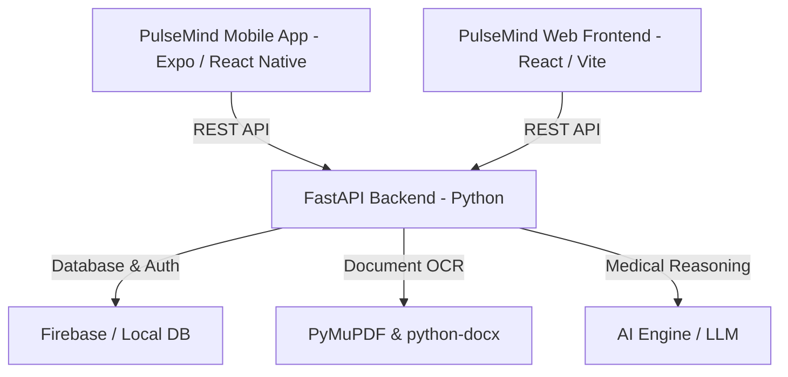

# 🏥 PulseMind AI — Next-Gen AI Health & Medical Intelligence Platform


**PulseMind AI** is an advanced end-to-end medical intelligence ecosystem designed to streamline patient triage, automate prescription and medical report analysis, assist with medical imaging diagnostics, and offer real-time national healthcare analytics across web and mobile platforms.

---

## 🚀 Key Features

- **🩺 AI Medical Chat & Triage Assistant:** Real-time conversational agent for preliminary symptom assessment, health query resolution, and actionable recommendations.
- **📄 Prescription & Report Scanner:** Automatically extracts and interprets clinical data, lab reports, and doctor prescriptions from uploaded PDFs, DOCX files, and images.
- **🔬 Medical Imaging Diagnostic Engine:** AI-assisted computer vision pipeline for reviewing X-rays, MRIs, and CT scans.
- **📊 National Impact & Analytics Dashboard:** Interactive data visualizations (powered by Recharts and Plotly.js) providing epidemiological insights and health statistics.
- **🔐 Secure Role-Based Authentication:** Firebase-authenticated workflows supporting Patient, Doctor, and Administrator views.
- **📱 Cross-Platform Mobile Experience:** Dedicated Expo React Native mobile application for on-the-go patient and clinical access.

---

## 🛠️ Architecture & Tech Stack



### **Backend (`/backend`)**
* **Framework:** Python, FastAPI, Uvicorn
* **Database & Auth:** Firebase Admin SDK, Local JSON fallback
* **Document Processing:** PyMuPDF (`fitz`), `python-docx`
* **Data Validation:** Pydantic v2

### **Web Frontend (`/frontend`)**
* **Framework:** React 18, Vite, TypeScript
* **Styling:** Tailwind CSS, Lucide React Icons
* **Data Visualization:** Recharts, Plotly.js
* **Routing & Auth:** React Router v6, Firebase Client SDK

### **Mobile App (`/PulseMind AI-mobile`)**
* **Framework:** React Native, Expo (SDK 54), Expo Router
* **State & Storage:** Async Storage, Firebase SDK

---

## 📁 Repository Structure

```
PulseMind-AI/
├── backend/                  # FastAPI Python backend server
│   ├── database/             # Database connection & models
│   ├── engines/              # AI processing engines
│   ├── uploads/              # Uploaded reports, images, prescriptions
│   ├── main.py               # API entry point & endpoints
│   └── requirements.txt      # Python dependencies
├── frontend/                 # React + Vite web dashboard
│   ├── src/
│   │   ├── components/       # Reusable UI components
│   │   ├── pages/            # Admin, Dashboard, Chat, Scanner, Imaging
│   │   ├── api.ts            # API service calls
│   │   └── firebase.ts       # Firebase config
│   └── package.json
├── PulseMind AI-mobile/      # Expo React Native mobile app
│   ├── app/                  # Expo Router file-based screens
│   ├── components/           # Mobile UI components
│   └── package.json
└── README.md
```

---

## ⚡ Getting Started

### 1. Prerequisites
- **Node.js** (v18 or higher)
- **Python** (v3.10 or higher)
- **npm** or **yarn**

---

### 2. Backend Setup (`/backend`)

```bash
# Navigate to the backend directory
cd backend

# Create a virtual environment
python -m venv venv

# Activate virtual environment
# On Windows:
venv\Scripts\activate
# On macOS/Linux:
source venv/bin/activate

# Install dependencies
pip install -r requirements.txt

# Start the FastAPI dev server
uvicorn main:app --reload --port 8000
```
> The API will be available at `http://localhost:8000` (Docs at `http://localhost:8000/docs`).

---

### 3. Frontend Web Setup (`/frontend`)

```bash
# Navigate to the frontend directory
cd frontend

# Install dependencies
npm install

# Start Vite dev server
npm run dev
```
> Access the web dashboard at `http://localhost:5173`.

---

### 4. Mobile App Setup (`/PulseMind AI-mobile`)

```bash
# Navigate to the mobile app directory
cd "PulseMind AI-mobile"

# Install dependencies
npm install

# Start Expo dev server
npx expo start
```
> Scan the QR code using the **Expo Go** app on iOS or Android.

---

## 🔒 Security & Privacy Notice

- **Environment Variables:** Confidential API keys and credentials (such as Firebase Admin SDK keys and `.env` files) are strictly excluded via `.gitignore`.
- **Medical Disclaimer:** PulseMind AI is designed to assist healthcare professionals and provide informational guidance. It does not replace professional medical diagnosis or emergency services.

---

## 📄 License

Distributed under the MIT License. See `LICENSE` for details.